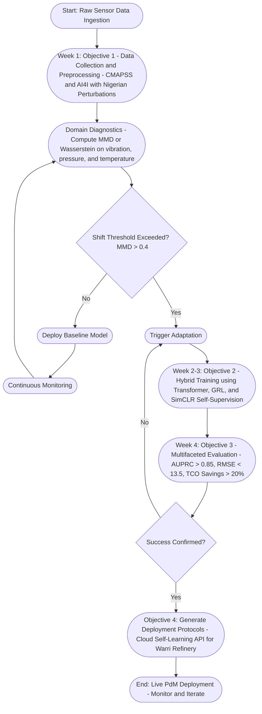

```mermaid
flowchart TD
    A([Start: Raw Sensor Data Ingestion])
    B([Week 1: Objective 1 - Data Collection and Preprocessing - CMAPSS and AI4I with Nigerian Perturbations])
    C([Domain Diagnostics - Compute MMD or Wasserstein on vibration, pressure, and temperature])
    D{Shift Threshold Exceeded?  MMD > 0.4}
    E([Deploy Baseline Model])
    F([Trigger Adaptation])
    G([Continuous Monitoring])
    H([Week 2-3: Objective 2 - Hybrid Training using Transformer, GRL, and SimCLR Self-Supervision])
    I([Week 4: Objective 3 - Multifaceted Evaluation - AUPRC > 0.85, RMSE < 13.5, TCO Savings > 20%])
    J{Success Confirmed?}
    K([Objective 4: Generate Deployment Protocols - Cloud Self-Learning API for Warri Refinery])
    L([End: Live PdM Deployment - Monitor and Iterate])

    A --> B --> C --> D
    D -->|No| E --> G --> C
    D -->|Yes| F --> H --> I --> J
    J -->|Yes| K --> L
    J -->|No| F
```
