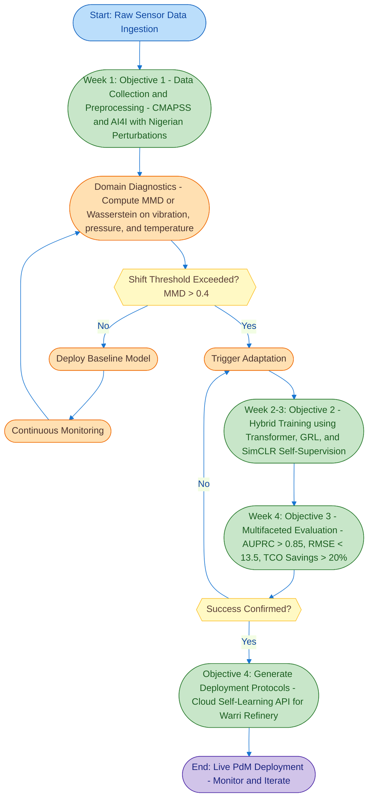

```mermaid
%%{init: {
  "theme": "base",
  "themeVariables": {
    "background": "#ffffff",
    "primaryColor": "#E3F2FD",
    "primaryTextColor": "#0D47A1",
    "primaryBorderColor": "#1976D2",
    "lineColor": "#1976D2"
  }
}}%%
flowchart TD
    %% Nodes
    A([Start: Raw Sensor Data Ingestion])
    B([Week 1: Objective 1 - Data Collection and Preprocessing - CMAPSS and AI4I with Nigerian Perturbations])
    C([Domain Diagnostics - Compute MMD or Wasserstein on vibration, pressure, and temperature])
    D{{Shift Threshold Exceeded?  MMD > 0.4}}
    E([Deploy Baseline Model])
    F([Trigger Adaptation])
    G([Continuous Monitoring])
    H([Week 2-3: Objective 2 - Hybrid Training using Transformer, GRL, and SimCLR Self-Supervision])
    I([Week 4: Objective 3 - Multifaceted Evaluation - AUPRC > 0.85, RMSE < 13.5, TCO Savings > 20%])
    J{{Success Confirmed?}}
    K([Objective 4: Generate Deployment Protocols - Cloud Self-Learning API for Warri Refinery])
    L([End: Live PdM Deployment - Monitor and Iterate])

    %% Flow
    A --> B --> C --> D
    D -->|No| E --> G --> C
    D -->|Yes| F --> H --> I --> J
    J -->|Yes| K --> L
    J -->|No| F

    %% Colors (GitHub-safe names)
    classDef startNode fill:#BBDEFB,stroke:#1565C0,color:#0D47A1;
    classDef objectiveNode fill:#C8E6C9,stroke:#2E7D32,color:#1B5E20;
    classDef decisionNode fill:#FFF9C4,stroke:#FBC02D,color:#5D4037;
    classDef processNode fill:#FFE0B2,stroke:#EF6C00,color:#4E342E;
    classDef endNode fill:#D1C4E9,stroke:#512DA8,color:#1A237E;

    class A startNode;
    class B,H,I,K objectiveNode;
    class C,E,F,G processNode;
    class D,J decisionNode;
    class L endNode;
```
